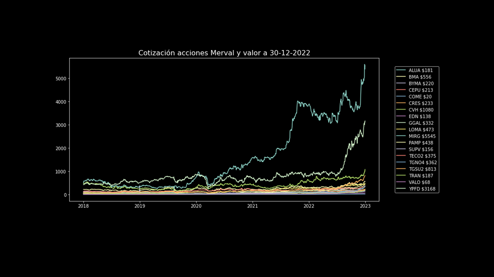
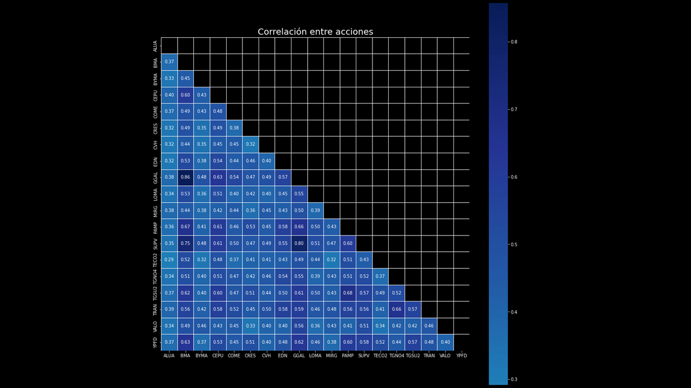
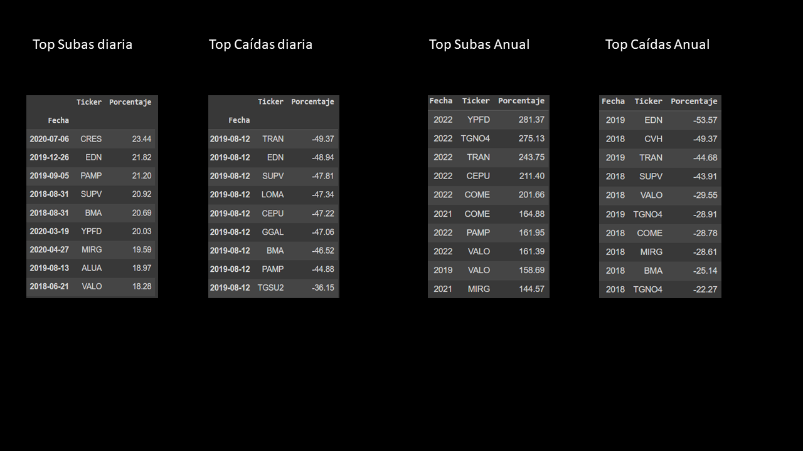
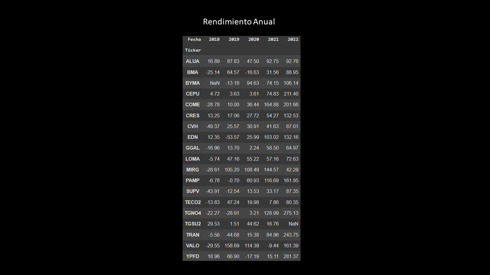

## Evolución del rendimiento de las acciones que componen el Panel Líder del S&P Merval (2018-2022)  

Notebook: https://nbviewer.org/github/MartinRV19/acciones-merval/blob/main/acciones_Merval.ipynb

